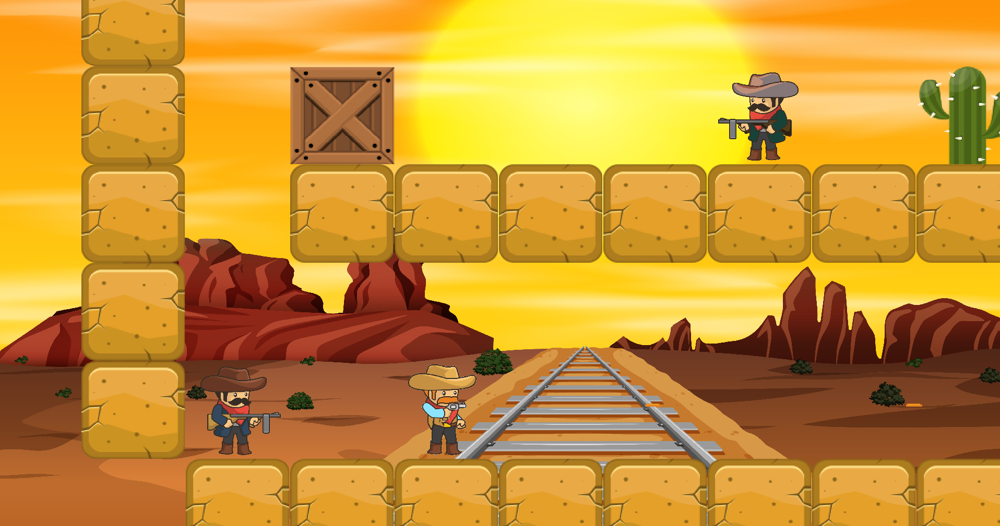

# Dangerous West




> Jogo de Plataforma desenvolvido em C++. Criado para ser jogado em dupla no mesmo dispositivo, tendo em vista que não possui um servidor para jogar online.

## 💻 Pré-requisitos

Antes de começar, verifique se você atendeu aos seguintes requisitos:

* Máquina equipada com `Linux`.
* Ter o `Make` instalado na CLI.

## 🚀 Instalando Jogo

Para instalar o Dangerous West, siga estas etapas:

Clone o repositório
```
git clone https://github.com/squire-tap/Dangerous-West.git
```
Entre na pasta do projeto
```
cd Dangerous-West
```
Execute o script para gerar o executável
```
make
```
Entre na pasta contendo os arquivos binários
```
cd bin 
```
Execute o binário para rodar o jogo
```
./main
```

## :video_game: Comandos do Jogo

###### Jogador 1

`W`(pular) `A`(esquerda) `D`(direita) `ESPACE`(atira)

###### Jogador 2

:arrow_up:(pular) :arrow_left:(esquerda) :arrow_right:(direita) :mouse:(atira)


## 📝 Licença

Esse projeto está sob licença. Veja o arquivo [LICENÇA](LICENSE) para mais detalhes.

[⬆ Voltar ao topo](#Dangerous-West)<br>
